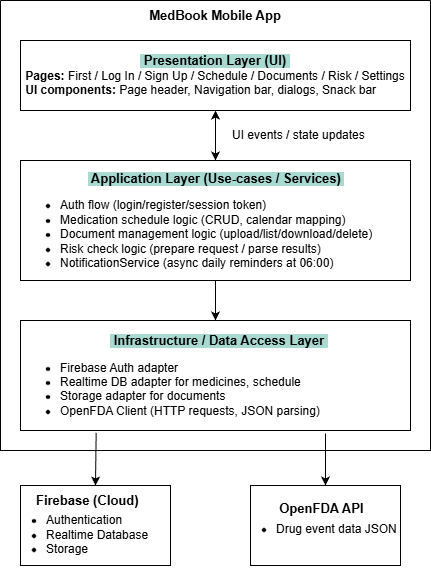
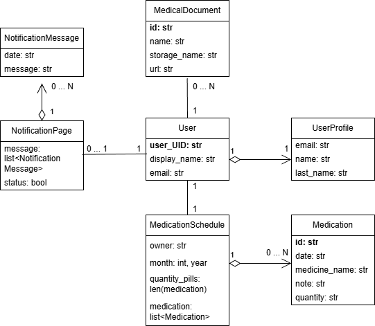
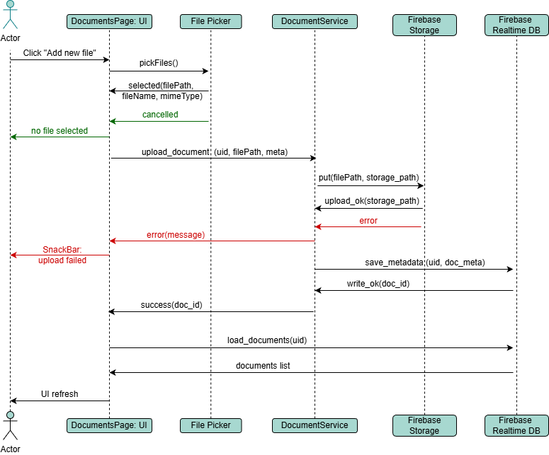
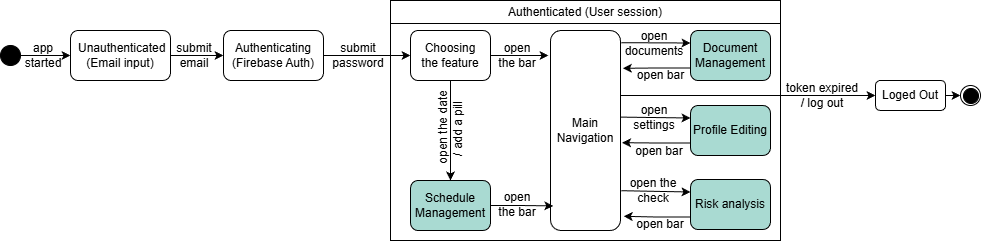
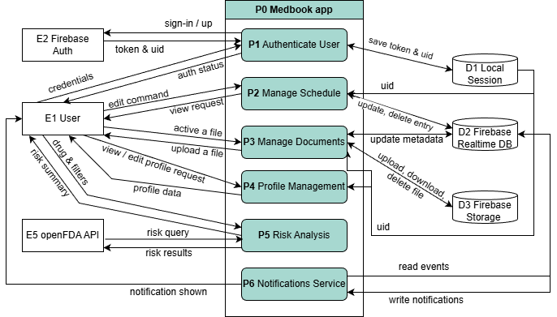
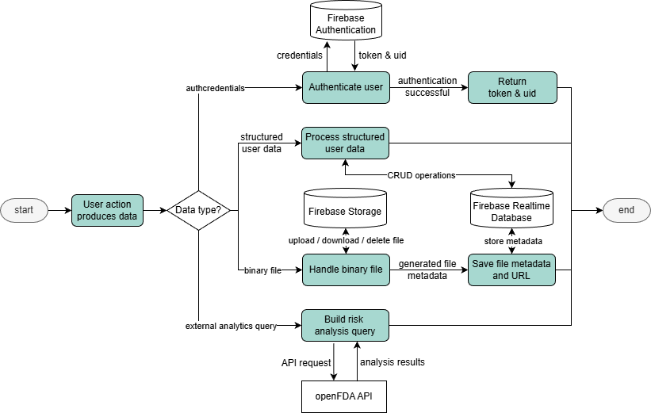

# Design

This chapter describes the design decisions and architectural strategies adopted to satisfy the requirements identified during the analysis phase. The focus is on the overall system architecture, component responsibilities, domain modeling, system behavior, and data management.

## Architecture

At a high level, MedBook is designed as a client-centric application supported by cloud-based backend services. The system is composed of the following core components:
* Mobile application, developed using the Flet framework, responsible for user interaction and UI rendering.
* Firebase services, which provide authentication, real-time data persistence, file storage, and cloud-based synchronization.
* External medical data API (OpenFDA), used for drug risk analysis and safety-related information retrieval.

This architecture allows MedBook to remain lightweight on the client side while delegating scalability, security, and persistence concerns to managed cloud services.

The application follows a layered architectural approach, adapted to a client–cloud environment:

    

        

            <ul>
                <li> <b>Presentation Layer</b>: implemented using Flet UI components. This layer handles user interaction, navigation between pages, and data visualization (calendars, charts, document lists). </li>
                <li><b>Application / Business Logic Layer</b>: encapsulates core logic such as medication scheduling, validation rules, notification handling, user profile updates, and interaction with external APIs. </li>
                <li> <b>Persistence and Integration Layer</b>: acts as an interface between the application logic and external services, including: </li>
                    <ul>
                        <li>Firebase Realtime Database</li>
                        <li>Firebase Authentication</li>
                        <li>Firebase Storage</li>
                        <li>OpenFDA API</li>
                    </ul>
                <li><b>Data Layer</b>: cloud-managed services responsible for storing structured data, unstructured documents, and user credentials.</li>
            </ul>
        

    

    

The application follows a layered architectural approach, adapted to a client–cloud environment:
* **Presentation Layer**: implemented using Flet UI components. This layer handles user interaction, navigation between pages, and data visualization (calendars, charts, document lists).
* **Application / Business Logic Layer**: encapsulates core logic such as medication scheduling, validation rules, notification handling, user profile updates, and interaction with external APIs.
* **Persistence and Integration Layer**: acts as an interface between the application logic and external services, including:
    * Firebase Realtime Database
    * Firebase Authentication
    * Firebase Storage
    * OpenFDA API
* **Data Layer**: cloud-managed services responsible for storing structured data, unstructured documents, and user credentials.

## Modelling

This section describes how the domain of the application has been modeled.
The core domain entities of MedBook include concepts such as:
* User
* Medication schedule
* Medication
* Document
* Notification
* User profile

These entities and their relationships are represented using **Class Model**:

This diagram focuses on:
* Key attributes and associations
* Domain responsibilities
* Logical structure of the system

## Interaction

The System Interactions section describes how the main components of MedBook collaborate to implement key user scenarios. The application follows a UI-driven flow (Flet pages and dialogs) where user actions trigger service calls responsible for authentication, data persistence, and external API communication.

Examples of modeled interactions include:
* User authentication and session initialization;
* Adding a new medication to the schedule;
* Uploading and retrieving medical documents;
* Performing a pill risk analysis via OpenFDA;
* Updating the user profile

To illustrate the interaction style adopted in MedBook, the **sequence diagram** below shows the `Document Upload workflow`. The user initiates the process from the Documents page, selects a file through the FilePicker, and the application uploads the file to Firebase Storage. After a successful upload, the application stores the document metadata in Firebase Realtime Database and refreshes the UI list to display the newly added document. This scenario highlights how MedBook integrates UI events, internal services, and Firebase components to deliver an end-to-end user feature.

## Behaviour

The system interaction in MedBook can be described as a **dynamic, scenario-driven flow**: the overall behavior of the application changes depending on which feature is currently open, because the user’s goals and actions differ across application modules. All user scenarios share a common foundation — User Identification and Authentication — after which the user can access the available features inside an authenticated session.

Key user scenarios include:
action / Sequence часть (или как подводку перед диаграммами). Я сделал его таким, чтобы он звучал профессионально и ровно отражал твою мысль про “динамичные сценарии” и “иерархию” (high-level → low-level).

Dynamic Interaction Perspective

The system interaction in MedBook can be described as a dynamic, scenario-driven flow: the overall behavior of the application changes depending on which feature is currently open, because the user’s goals and actions differ across application modules. For this reason, the interaction layer is best represented through a set of sequence diagrams, each covering a specific user scenario. All scenarios share a common foundation — User Identification and Authentication — after which the user can access the available features inside an authenticated session.

Key user scenarios include:
* User identification (unauthenticated, authenticated, logged out);
* Medication lifestyle management (scheduled, taken, missed);
* Document management;
* Profile editing;
* Risk analysis.

The **State diagram** below provides a **high-level interaction overview** of the entire application workflow. Elements highlighted in *green* represent complex steps (macro-actions) that encapsulate multiple sub-operations and can be further decomposed into lower-level sequence diagrams for more detailed analysis

## Data-related Aspects

This section describes how data is structured, exchanged, and managed within the MedBook application.
To provide a clear overview of data responsibilities and interactions, the system has been modeled using **Data Flow Diagrams**. In particular, DFD Level 0 is used to decompose the main system process (P0 – MedBook Application) into a set of core functional processes, each responsible for a well-defined subset of data operations.

At DFD Level 0, the application is divided into the following data-centric processes:
* **P1 Authentication & Session Management**, responsible for user identity verification and session state handling.
* **P2 Medication Schedule Management**, managing medication plans, calendar entries, and intake status.
* **P3 Documents Management**, handling user medical documents such as PDF files and images.
* **P4 Risk Analysis**, performing drug risk assessment through external data sources.
* **P5 Notifications Service**, generating and synchronizing medication reminders and notification states.
* **P6 Profile Management**, managing user personal data and synchronizing profile updates across services.

### Data Persistence Technologies
MedBook employs a combination of cloud-based persistence technologies to support the different data lifecycles identified in the DFD Level 0 decomposition. Each persistence mechanism is selected based on the nature of the data, its access patterns, and consistency requirements.

* **Firebase Realtime Database** is used for storing structured data such as medication schedules, reminders, and user-related metadata.
* **Firebase Storage** is used for storing unstructured data, including medical documents and images (PDFs, scans, lab results).
* **Firebase Authentication** is used for secure user identity management.

A flow chart illustrating the **Routing by Data Type** is provided to explain how MedBook selects the appropriate persistence technology depending on the nature of the data being processed:

