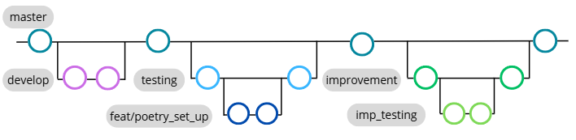

# Development

## DVCS

To track the development of our project, the dedicated organization called `unibo-dtm-se-2324-MedBook` was created and Github repositories were used. The repository called [medbook-business-report](https://github.com/unibo-dtm-se-2324-MedBook/medbook-business-report) contains the business description for the MedBook project, when the code of the artifact lives in a separate repository: [medbook-application-core](https://github.com/unibo-dtm-se-2324-MedBook/medbook-application-core).

Medbook-application-core was divided into several branches: the `master` branch contains project releases, and the `develop` branch was used for ongoing development, branch `testing` contains tests development for the first release of an application. After first release, the decision to improve the app was taken. That's why branch `improvement` contaions new modifications, and `imp_testing` was created from 'improvement' to test features and fixes. 



## Commit Conventions

At the early stage of the project, commits were created using free-form messages without a strict structure. While this approach allowed rapid iteration during initial development, it became less effective as the codebase grew and the number of changes increased.

To improve communication clarity, traceability of changes, and overall maintainability, the project transitioned to using **Conventional Commits**. This convention provides a standardized format for commit messages, making it easier for developers and reviewers to understand the intent and impact of each change at a glance.

Adopting Conventional Commits brings several advantages:
* Clear distinction between different types of changes;
* Improved readability of the commit history;
* Easier generation of changelogs and release notes.

Each commit message follows the structure:

```
<type>(<scope>): <short description>
```
Where:
* type describes the nature of the change (e.g. feat, fix, refactor, docs, test, chore)
* scope specifies the affected module or feature (optional)
* description provides a concise explanation of the change

This convention ensures that the evolution of the MedBook project remains transparent, structured, and easy to navigate for both current and future contributors.

## Implementation Details

During the development of the MedBook application, several implementation aspects required non-trivial design decisions and led to valuable technical learning outcomes.

One of the most significant insights gained was building software with **real-world purpose** and **user value**. MedBook was not developed as a purely academic exercise, but as a practical application aimed at solving real problems related to personal health management. This approach helped reinforce product-oriented thinking and the need to design features that deliver meaningful outcomes for end users.

Other aspect was the importance of **separating responsibilities** within the application architecture. The project was structured into clear layers, including UI components, service logic, and shared utilities. This separation improved code readability, maintainability, and allowed independent evolution of user interface and business logic.

The integration with **Firebase services** was also a key learning point. The project combines Firebase Authentication for user management, Firebase Realtime Database for structured data (e.g. medication schedules), and Firebase Storage for handling medical documents. Designing a consistent data flow across these services helped strengthen understanding of cloud-based backend architectures.