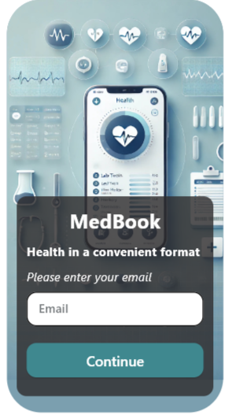
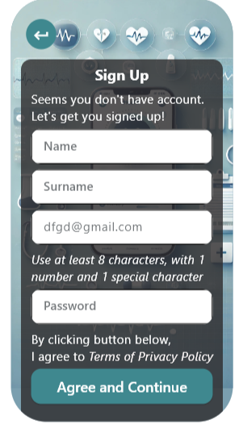
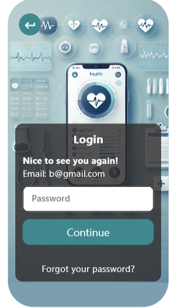
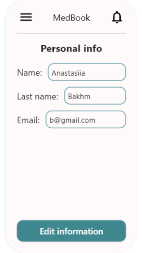
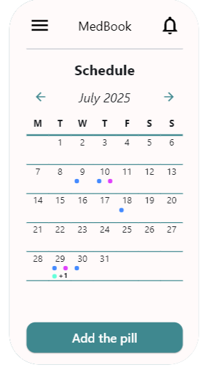
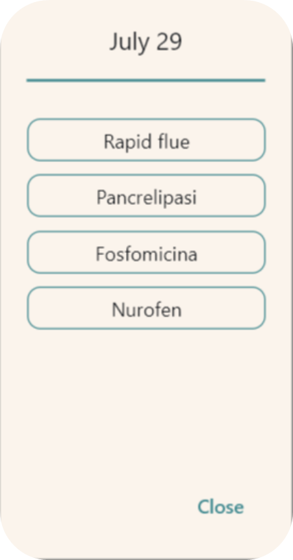
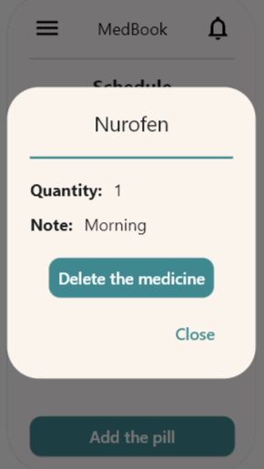
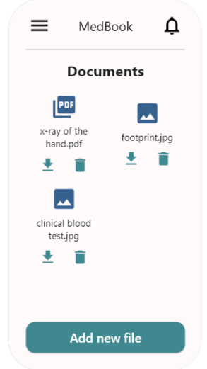
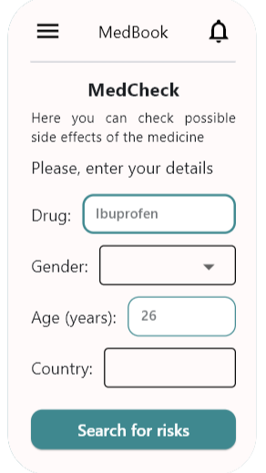
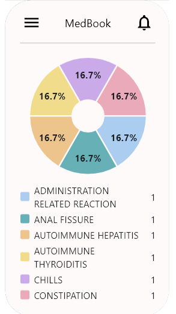

# User Guide

MedBook is a mobile application designed to help users manage their personal medical information in a digital and structured way.

## Getting Started

    
    
    
    

1. Enter your email address.
2. Authentication flow
    * If the email address is already registered, you will be redirected to the **Login page** to enter your account password.
    * If the email address is not registered, you will be redirected to the **Sign up page** to create a new account.
3. Register (for new users). New users must complete the registration form by providing the required personal details and setting a secure password.
4. Log in. Existing users can log in by entering the password associated with their account.
5. To modify your personal data (such as name or email address), need to access the **Settings** and then select the profile option.
6. To log out of your account, use the corresponding button located in the navigation bar.

## Application Features

Once you are logged in, you will have access to the full functionality of MedBook.

### Medication Schedule and Calendar

After logging in, you will be redirected to the **Medication Schedule page**:

    
    
    
    

* This page displays a monthly calendar showing your medication intake plan.
* By clicking on a specific date, you can view all medications scheduled for that day.
* By selecting a medication name, you can open a detailed view containing:
    * dosage information;
    * additional notes;
    * and other relevant details.
* You can also add a new medication by clicking the "Add Medicine" button on this page.

### Medical Documents Management

    
    

        

        By selecting "Documents" in the navigation bar, you will open <b>Documents section page</b>:
            <ul>
                <li> Here you can upload medical files in PDF format or as image files. </li>
                <li>Uploaded documents can be viewed, downloaded, or removed at any time. </li>
            </ul>
        

    

### Medication Risk Check

By selecting "Check" in the navigation bar, you will open **Medication Risk Check page**:

    
    

* It allows you to assess potential risks related to a specific medication.
* You will need to enter:
    * the medication name,
    * your personal data (such as age, gender, and country of origin).

After clicking the Check button, the application displays a pie chart visualizing potential risk levels based on the provided information.